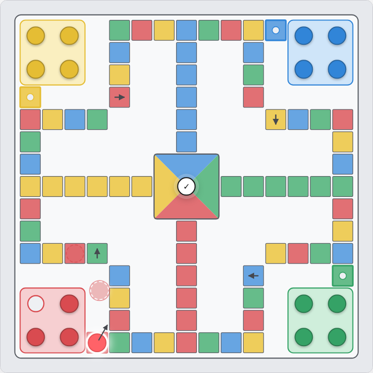
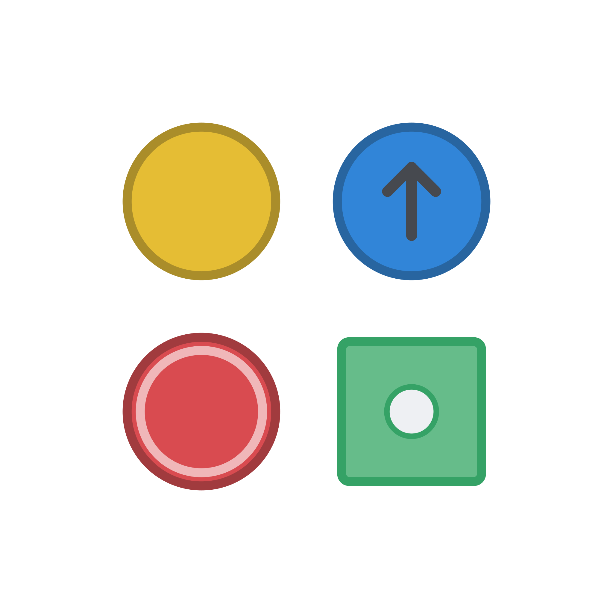

# 双飞 Double Ludo

> 特别好玩！一名玩家同时控制两种颜色、每回合投掷两枚骰子的双人飞行棋

by IQ Online Studio, github.com/iqonli/double-ludo

Original game by PerryDing 2025-07-23

项目仓库：https://github.com/iqonli/double-ludo

本项目使用[MIT许可证](LICENSE)。Copyright © 2026 IQ Online Studio.

[点击此处直接游玩](https://iqonli.github.io/double-ludo/)

<p align="center">
  
</p>


## 介绍

本项目包括《双飞》、《极速双飞》的游戏玩法，和一个包含这两种玩法的网页实现。

普通飞行棋中，一名玩家通常只控制一种颜色。《双飞》中，每名玩家同时控制两种颜色，并在自己的回合投掷两枚骰子。两枚骰子如何分配、先走哪种颜色、具体移动哪枚棋子，都可能改变后续结果。第一枚棋子行动后产生的跳四、飞线、吃子、折返和位置变化，会直接影响第二枚棋子的选择。因此，一次回合通常由两次相互关联的行动组成。

《极速双飞》沿用双骰分色、6点追加、交换、跳四、飞线和终点折返等主要规则，每种颜色只保留一枚棋子，并取消吃子，适合较短的对局。

网页目前包含：

- 本地双人对战
- “正常”和“高级”两个人机模型（基于规则搜索的人机对战模型）
- 同时支持局域网和Render云端部署的多房间权威服务器
- 本地五位数字登录码、在线“5位数字+字母”登录码和邀请链接自动连接
- 联机聊天、未读提示和交流弹窗
- 丝滑的动画
- 对局导出、恢复和服务端自动存档
- 可旋转棋盘、可拖动左右栏和可调高度的聊天卡片

<p align="center">
  
</p>


## 提示

1. 本项目提供的网页实现同时支持本地对战和联机对战。本地对战可以直接打开`public/game.html`，或[点击此处直接游玩](https://iqonli.github.io/double-ludo/)；局域网服务器需要Node.js 18（[前往下载](https://nodejs.org)）或更高版本。
2. 本地服务器继续使用五位数字登录码；Render在线服务器使用“5位数字+1位字母”登录码，并提供账号开房、每IP账号归属限制和失败登录限速。
3. 服务端会在`6666–8888`中随机选择可用端口。Windows首次开服时，若系统询问防火墙选项，请允许专用网络访问。
4. 对局文件是普通JSON，可以手工修改。恢复时只做基本结构检查，不提供反作弊功能。
5. 《双飞》的规则边界较多。发现网页行为与本文不一致时，请提Issue并附上对局文件、操作步骤和浏览器控制台信息。

## 安装与使用

### 下载项目

优先选择打包下载仓库，或克隆仓库：

```bash
git clone https://github.com/iqonli/double-ludo.git
cd double-ludo
```
也可以从[Release](https://github.com/iqonli/double-ludo/releases)中下载。

### 本地对战

1. 直接打开`public/game.html`，或[点击此处直接游玩](https://iqonli.github.io/double-ludo/)。
2. 选择`本地对战`。
3. 选择`双飞`或`极速双飞`；玩家A选择两种颜色，剩余两种颜色自动归于玩家B。
4. 根据需要进行设置。
5. 点击`开始游戏`。

本地双飞可以为玩家A、玩家B分别启用人机，极速双飞暂不启用人机。

### Render云端联机

项目可以直接部署为Render Web Service。同一个`public/game.html`既能连接本地服务器，也能连接Render地址。云端开房、环境变量和管理员设置见[`RENDER_DEPLOY.md`](RENDER_DEPLOY.md)。

玩家使用前应阅读[`PLAYER_NOTICE.md`](PLAYER_NOTICE.md)。在线模式的账号、房间、聊天和对局只保存在内存中，免费服务休眠、重启或重新部署后会全部清空。

邀请链接格式类似：

```text
https://dlol.onrender.com/game.html?port=54321U&URL=https%3A%2F%2Fdlol.onrender.com
```

打开后会自动切换到联机页面并尝试连接。游戏、开房和管理API遇到短暂404时，会按100ms×10、200ms×10、300ms×5的顺序重试，最后仍失败才显示404。

在线账号规则：同一IP最多拥有5个账号，同时只能管理1个账号；登录第6个账号时会删除该IP最早拥有的账号及其全部房间。账号被新IP接管时，账号房间一并转移到新IP。每个账号最多5个房间，不再设置单独的IP房间数量上限。错误登录码的尝试间隔为1秒。

### 启动局域网服务器

项目没有第三方npm运行依赖。安装Node.js 18或更高版本后，在项目根目录运行：

```bash
npm start
```

Windows也可以双击：

```text
start-server.bat
```

Linux或macOS可以运行：

```bash
./start-server.sh
```

服务端启动后会输出类似内容：

```text
双飞 v0.42.2 多房间局域网服务器已启动
本次随机端口：6666
管理页面：http://127.0.0.1:6666/admin
本机游戏：http://127.0.0.1:6666/game.html
也可直接双击 public/game.html，再输入服务器IP、端口和登录码。
局域网游戏：http://192.168.1.11:6666/game.html
```

管理页面只供开服设备使用，当然用别的设备访问也是可以的。其他玩家打开控制台列出的局域网游戏地址即可；其他玩家也可以在下载本项目后，打开自己的`public/game.html`，选择`联机对战`，再填写服务器IP、端口和五位登录码。若浏览器限制本地HTML访问局域网，可以改用服务器提供的`http://IP:端口/game.html`。

### Android设备开服

Android可以在能够运行Node.js的环境中启动服务器，例如Termux：

```bash
pkg install nodejs
cd double-ludo
npm start
```

开服期间应避免系统清理Termux后台进程。不同Android系统的后台杀进程力度不一致，请注意保持前台。

## 局域网开房与开局流程

### 服务端

1. 打开控制台显示的管理页面。服务端默认创建房间1；需要更多房间时点击`新建房间`。
3. 每个房间都有玩家A和玩家B的五位登录码，点击`复制登录码`或`复制端口+登录码`发给对应玩家。登录码在当前服务器的所有房间中唯一。游戏端只输入登录码，无需输入房间号。
5. 服务端可以为各房间重新开局、刷新登录码、导出对局、恢复对局或关闭房间。刷新登录码后，旧登录码和旧会话立即失效，棋局状态保留。关闭房间不会影响其他房间。
6. 点击房间卡片会切换服务端聊天所对应的房间。

> 设计是玩家A的决策优先级高于玩家B，请注意

### 关于局域网连接的一些提示……

选择`联机对战`后，会自动填写所有可填写项。

`智能输入`可以从一段文字中提取：

- 第一个合法IPv4地址；
- 第一个独立的四位数字作为端口；
- 第一个独立的五位数字作为登录码。

例如输入：

```text
服务器192.168.1.17 端口8406，玩家B登录码82525
```
点击`输入`后会自动填写三个输入框。

### 玩家A

1. 选择`联机对战`，填写IP、端口和玩家A登录码，也可以将全部内容粘贴到智能输入。
2. 根据需要进行设置。
3. 若选择`双飞`，则选择自己的永久保护颜色，出现红字提示时点击`提交`。
4. 若选择`极速双飞`，则点击`玩家A投掷`。每次开局只能投掷一次。
5. 等待玩家B完成设置并点击`准备`。
6. 按钮由`等待玩家B准备`变为`开始局域网游戏`后，点击开始对局。

### 玩家B

1. 选择`联机对战`，填写IP、端口和玩家B登录码，也可以将全部内容粘贴到智能输入。
2. 玩家A选好两种颜色后，玩家B会看到自己的颜色。
3. 若为`双飞`，则设置永久保护并点击`提交`。
4. 若为`极速双飞`，则点击`玩家B投掷`。每次开局只能投掷一次，投掷前不能准备。
5. 点击`准备`，等待玩家A开始。

开局时玩家间可以互相沟通。玩家B的准备状态会随着玩家A修改设置而自动取消。

## 游戏操作指南

### 投骰和移动

1. 轮到自己时点击`投掷`。
2. 点击要使用的骰子。此时可以取消勾选骰子或切换骰子。
3. 棋盘上发白光、闪烁并原地大小变的棋子是当前可选/候选棋子。
4. 将鼠标悬停在可选棋子上，会循环播放丝滑的幽灵动画，以预览落子情况。
5. 点击棋子后，网页将再次播放丝滑的动画。

联机时，客户端只做宽松的操作检查，最终是否合法由服务端规则引擎决定。

### 二次确认

一个专为触屏优化的选项。勾选`二次确认`后，点击棋子会先“锁定候选”，并循环播放幽灵动画，这是在模拟鼠标的悬停。

如果遇到叠放的棋子，会先锁定展开状态，此时点击棋盘的空白区域会取消展开；再点击任一棋子才会完成对棋子的锁定。

锁定后，候选棋子上会出现一个提示箭头，这个箭头指向了棋盘中心的一个确认按钮。点击确认按钮，即可确认落子。

点击棋盘的空白区域和`取消`可以取消锁定候选。

### 交换棋子

点击`交换棋子`后，依次点击两枚自己的不同颜色的不同格子的棋子。交换会放弃本次投掷，并重新结算两枚棋子的落子效果。

如果两枚棋子的结算顺序会影响结果，会要求选择先结算哪一枚。

### 撤销

本地模式在规则允许的时机点击`撤销`，即可撤销最近一次动作。

联机时，撤销需要对方同意：

1. 操作者点击`撤销`
2. 对方会看到弹窗，选择`拒绝`或`允许`
4. 允许后，服务端恢复动作，双方播放反向动画

拒绝后仍可再次申请，不限制申请次数。撤销申请期间可以继续使用弹窗内的聊天。

### 三6遣返弹窗

同一种颜色在同一回合连续获得第三个6时，该颜色全部棋子返回机场。网页会弹出三6遣返窗口：

- 点击“我接受”确认遣返；
- 连续点击10次“反悔”可以取消此次遣返。

联机时，受到三6遣返一方会展示弹窗，此时会进入申请、沟通阶段，跟随指引进行操作即可。

### 联机聊天

准备阶段、游戏阶段、三6遣返和撤销申请期间都可以使用聊天。

- 默认按Enter发送，Shift+Enter换行
- 点击按钮可以切换为Shift+Enter发送，Enter换行
- 自己发送的消息是蓝色背景
- 服务端消息是黄色背景
- 接收到新消息时，聊天卡片背景抖动、闪烁，并伴随灵动动画
- 若滚动条位于底部，新消息自动滚动；离开底部后会保持当前位置，并显示未读消息气泡
- 上下边界可以拖动调整高度，默认高度为500px

### 棋盘和界面

- 顶栏的左右箭头可以将棋盘旋转90度
- 棋子编号和完成数量会反向补偿旋转，保持正向阅读
- 左栏和右栏之间的分隔条可以拖动，两栏默认宽度均为350px
- 页面会把自定义栏宽和聊天高度保存在当前浏览器中
- “循环播放等待、单步时长、特殊时长、阶段等待”只控制动画，不暂停网络通信

### 人机

`双飞`本地模式提供两个模型：

| 模型 | 说明 |
| --- | --- |
| 正常 | 训练检查点约2207万步，适合普通本地对局 |
| 高级 | 训练检查点约4637万步，策略更成熟 |
| 等待更多…… | |

目前的模型均来自Stable-Baselines3 `MaskablePPO`，网页只保留推理所需的策略网络。模型结构和转换误差见[`public/MODEL_INFO.md`](public/MODEL_INFO.md)。

开局时可以分别设置玩家A和玩家B是否由人机控制，游戏开始后也可以在玩家信息卡片中切换控制权或夺回控制权。

### 对局文件和自动恢复

服务端每个房间都可以独立导出JSON对局文件，也可以恢复先前导出的文件。

- 大厅文件包含模式、颜色、保护、准备状态和极速双飞开局投掷
- 对局中的文件包含完整规则引擎快照
- 聊天和房间日志随文件保存
- 登录码和会话令牌不写入对局文件
- 恢复失败不会覆盖当前对局
- 对局文件允许手工修改，不做签名或严格防篡改验证

服务端还会将全部房间写入`data/autosave.json`。异常退出后重新启动，服务器会恢复房间、棋局、聊天和日志，并重新生成登录码。详细格式见[`SAVE_FORMAT.md`](SAVE_FORMAT.md)。

---

# 《双飞》与《极速双飞》入门规则

> 版本：预览v0.1
> 由ChatGPT 5.6 Sol High撰写
> Game by PerryDing

### 一、棋盘上的位置

一枚棋子的完整行程是：

```text
机场 → 起飞位 → 公共航道 → 终点跑道 → 终点
```

#### 机场

机场是《双飞》棋子的开局位置。每种颜色有四枚棋子，一名玩家控制两种颜色，共八枚棋子。

机场中的棋子不能正常前进，必须获得允许起飞的点数，才能进入起飞位。网页默认使用5和6，也可以在开局设置中改为其他点数。

#### 起飞位

棋子从机场移动到起飞位时，整枚骰子已经使用完毕，不会继续计算剩余步数。

起飞位仍不属于公共航道。下一次移动时，第一步才会进入公共航道起点。例如棋子位于起飞位并获得3点：第一步进入公共航道，之后再前进两步。

#### 公共航道

公共航道是四种颜色共同使用的环形路线，棋子沿固定方向顺时针前进。

公共航道中包含四条终点跑道的入口。本文把每条终点跑道的第一格记为`fin1`。

#### 终点跑道

每种颜色有一条六格终点跑道：

```text
fin1 → fin2 → fin3 → fin4 → fin5 → fin6 → 终点
```

本色棋子进入自己的`fin1`后，会沿`fin2`至`fin6`前进，最后抵达终点。

异色棋子正常移动时只会经过其他颜色的`fin1`。进入`fin1`消耗一步，下一步从跑道另一侧回到公共航道。异色棋子不会通过普通移动进入其他颜色的`fin2`至`fin6`。

例如，红色棋子距离黄色`fin1`还有三步并获得3点，第三步应落在黄色`fin1`，不能直接越过入口。

#### 终点

棋子从本色`fin6`继续前进并准确到达中心终点后完成。

一名玩家控制的两种颜色全部完成后，该玩家获胜。

### 二、开局准备

棋盘共有红、黄、蓝、绿四种颜色。

网页中由玩家A选择两种颜色，剩余两种颜色归玩家B。两种颜色可以相邻，也可以相对。颜色确认后，本局不再更换。

《双飞》每种颜色有四枚棋子；《极速双飞》每种颜色只有一枚棋子。

《双飞》默认玩家A先手。《极速双飞》由双方开局投掷决定先手。

---

## 第一部分：《双飞》

### 三、双骰怎样分配

轮到一名玩家时，玩家投掷两枚骰子，并把两枚骰子分别分配给自己控制的两种颜色。

假设玩家A控制红色和黄色，投出2和5。只要红色和黄色都还没有全部完成，就必须一枚骰子对应一种颜色：

- 2给红色、5给黄色；
- 或5给红色、2给黄色；
- 不能把2和5都给同一种颜色。

玩家可以自行决定先处理哪一枚骰子。第一种颜色完成普通移动、跳四、飞线和吃子后，再根据新的棋盘局势选择第二种颜色具体移动哪枚棋子。

第二种颜色的棋子不需要在第一枚棋子行动前决定。

### 四、骰子无法移动

选择骰子时，只能选择当前存在合法移动的骰子和棋子。

### 两枚骰子都不能使用

如果两枚骰子对两种颜色都没有合法移动，本次双骰结束，轮到下一名玩家。

例如，两种颜色的棋子都在机场，起飞点数为5和6，而玩家投出2和3，此时本回合直接结束。

#### 只有一枚骰子能够使用

如果只有一枚骰子能够移动，先使用它。第一种颜色确定后，剩余骰子归属于另一种颜色；如果另一种颜色仍然无法移动，该骰子作废。

例如红色和绿色都在机场，玩家投出2和6：

1. 6可以让其中一种颜色进入起飞位；
2. 玩家选择6交给红色；
3. 2随后归属于绿色；
4. 绿色不能使用2，2作废。

程序不会在玩家选择前擅自确定2属于哪种颜色。

### 五、机场中的棋子如何起飞

标准设置中，获得5或6时，可以把对应颜色的一枚机场棋子移动到起飞位。

起飞会消耗整枚骰子。例如机场中的红色棋子获得6，只移动到红色起飞位，不会再向公共航道前进六步。

网页允许在开局时勾选1至6中的任意起飞点数，但至少保留一个。

### 六、一个6：锁定颜色的单骰追加

如果双骰中只有一枚是6，完成本次双骰后，玩家追加投掷一枚骰子。追加骰子只能交给刚才使用6的颜色。

例如玩家A投出6和3，并把6交给红色、3交给黄色：两种颜色行动结束后追加一枚骰子，这枚骰子只能用于红色。

锁定单骰追加期间：

- 不能更换锁定颜色；
- 不能交换棋子；
- 如果锁定颜色没有合法移动，该追加机会结束；
- 即使最初的6没有可移动棋子，只要该6完成了颜色归属，追加机会仍按规则保留。

### 七、两个6：新的双骰追加

如果两枚骰子都是6，完成本次双骰后，再投掷一组双骰。

新的两枚骰子可以重新分配，不必沿用上一组双6的颜色顺序。因为它是一组新的双骰，投掷前可以申请交换棋子，并以交换代替本次投骰。

### 八、连续三个6

连续三个6按颜色分别计算。只有同一种颜色在同一回合内连续获得三个6，才触发遣返。

例如：

```text
红色获得6 → 黄色获得6 → 红色获得6 → 红色获得6
```

红色达成自己的第三个连续6，红色全部棋子返回机场，黄色不受影响。

某种颜色获得非6点数后，该颜色的连续计数中断。锁定单骰已经确定颜色，因此锁定单骰投出第三个6时，直接处理该颜色的遣返。

开局设置可以关闭“三6遣返”。

### 九、只剩一种颜色没有完成

如果一种颜色已经全部到达终点，只剩另一种颜色仍在场上，玩家依然投掷双骰，但只能从两枚骰子中选择一枚给剩余颜色。

例如黄色已经完成，只剩红色，玩家投出2和5：红色可以选择2或5，不能连续使用两枚骰子。

若此时投出双6，选择其中一个6完成行动后，仍会获得一组追加双骰；追加时同样只能选择其中一枚给剩余颜色。

### 十、普通移动与终点折返

棋子按照骰子点数逐步前进。

本色棋子进入自己的终点跑道后，沿`fin1`至`fin6`向中心移动：

- 点数刚好到达终点时，棋子完成；
- 点数超过终点时，在中心撞墙，并在本次移动中折返；
- 折返只消耗本次骰子的剩余步数。

异色棋子正常移动时，只会经过其他颜色的`fin1`，随后回到公共航道，不会进入`fin2`至`fin6`。

### 十一、跳四

棋子完成普通移动后，如果最终落在自己的同色公共格，会向前跳到下一枚同色格，通常相当于前进四格。

跳四只在最终落地后触发。经过同色格不会触发。

位于本色终点入口前的特殊同色格时，跳四应进入本色`fin1`，不能跨过入口落到后方公共格。

### 十二、飞线

棋子最终落在本色飞线起点时，会沿飞线移动到对应落点。

经过飞线起点不会触发。飞线途中也不会吃子，所有吃子只在完整行动的最终落点结算。

### 十三、跳四与飞线的连续结算

一次落子最多连续触发两个特殊移动阶段。

允许：

```text
跳四 → 飞线
飞线 → 跳四
```

第二个特殊阶段结束后，即使再次满足跳跃条件，也不继续触发。因此不存在：

```text
跳四 → 飞线 → 跳四
飞线 → 跳四 → 飞线
```

### 十四、吃子与共存

不同玩家的棋子在完整行动的最终落点重合时，通常由后到达的棋子吃掉先到达的棋子。被吃棋子返回对应颜色的机场。

以下位置都不会中途吃子：

- 普通移动经过的格子；
- 跳四的中间位置；
- 飞线起点和飞线途中；
- 终点折返途中。

同一玩家控制的两种颜色可以在同一格共存，不会互相吃子，也不会合并成一枚棋子。

### 十五、永久保护

《双飞》在开局准备阶段可以为自己的一种颜色或两种颜色设置永久保护。

保护颜色具有两个限制：

1. 不会被对方吃掉；
2. 也不能吃掉对方棋子。

受保护棋子与其他棋子落在同一格时直接共存。保护一旦提交，本局不再修改。

局域网中，玩家A和玩家B分别设置并提交自己的保护颜色。红字“当前设置未提交，请点击提交”消失后，才表示服务端已经接受。

### 十六、交换棋子

交换是《双飞》的主要特殊操作之一。玩家在允许的双骰投掷机会前，可以放弃这次投骰，改为交换自己的两枚棋子。

两枚棋子必须满足：

- 都属于当前玩家；
- 分属当前玩家控制的两种不同颜色；
- 是两枚不同棋子；
- 都不在机场；
- 不位于同一个物理格。

可以交换的时机：

- 普通新回合的双骰投掷前；
- 双6产生的追加双骰投掷前。

不能交换的时机：

- 已经投出骰子后；
- 单6产生的锁定单骰追加期间。

交换会放弃当前投骰机会。两枚棋子互换位置后，都视为重新落地，需要重新检查跳四、飞线、吃子和其他落地效果。

如果两枚棋子的结算顺序会影响结果，由执行交换的玩家决定先结算哪一枚；结果完全相同时无需选择。

### 十七、交换到异色终点跑道

交换可能把棋子放入普通移动无法进入的位置。

#### 异色`fin1`

棋子被交换到其他颜色的`fin1`后，不会继续深入异色跑道。下一次移动从`fin1`进入跑道另一侧的公共航道。

#### 异色`fin2`至`fin6`

棋子被交换到其他颜色的`fin2`至`fin6`后，会沿该跑道继续向深处移动，碰到尽头后折返，再经过`fin1`离开跑道，回到公共航道。

折返方向可以跨回合保留，直到棋子离开异色终点跑道。棋子的颜色身份始终不变，保护和吃子仍按棋子自身颜色判断。

### 十八、一个完整回合的例子

玩家A控制红色和黄色，投出6和4，并决定先处理红色：

1. 把6交给红色；
2. 选择一枚红色棋子移动；
3. 结算普通移动；
4. 若落在红色格，结算跳四；
5. 若随后落在红色飞线起点，结算飞线；
6. 检查最终落点是否吃子；
7. 把4交给黄色；
8. 根据红色行动后的棋盘选择黄色棋子并完成结算；
9. 因红色获得6，追加一枚只属于红色的锁定单骰。

锁定单骰投掷前不能交换棋子。

---

## 第二部分：《极速双飞》

### 十九、保留的规则

《极速双飞》保留以下结构：

- 一名玩家控制两种颜色；
- 每回合投掷双骰；
- 两枚骰子分别分配给两种颜色；
- 玩家决定颜色行动顺序；
- 单6产生锁定颜色的单骰追加；
- 双6产生可以重新分配的双骰追加；
- 连续三个6按颜色计算；
- 允许在双骰机会前交换不同颜色棋子；
- 跳四、飞线、终点折返和异色跑道规则不变。

### 二十、四项主要区别

#### 每种颜色只有一枚棋子

玩家仍控制两种颜色，但每种颜色只有一枚棋子。一名玩家总共控制两枚棋子。

选择某种颜色使用骰子后，不需要再从四枚棋子中选择。

#### 棋子开局位于起飞位

所有棋子开局直接放在各自的起飞位。第一次移动的第一步仍然是从起飞位进入公共航道。

三6遣返仍会把对应颜色送回机场；之后需要按本局起飞点数重新进入起飞位。

#### 双方分别投骰决定先手

正式开始前，玩家A和玩家B各自点击一次自己的投掷按钮。两枚骰子的点数和较高者先手。

点数和相同时由程序自动比较并决定先手，不要求玩家再次点击。局域网中，骰子和先手都由服务端生成并同步。

玩家B完成自己的开局投掷前不能点击“准备”。只有玩家A从《极速双飞》切回《双飞》，再切回《极速双飞》，双方的一次性投掷机会才会重置。

#### 禁止吃子

《极速双飞》中不发生吃子。不同玩家的棋子落在同一位置时直接共存。

由于禁止吃子，永久保护没有实际作用，极速模式不提供保护设置。

### 二十一、只剩一种颜色

一枚棋子到达终点后，该颜色立即完成。玩家之后仍然投掷双骰，但只能选择其中一枚给剩余颜色。

如果投出双6，仍获得一组追加双骰，并从追加双骰中选择一枚使用。

两枚棋子都到达终点后获胜。

---

## 第三部分：新手容易弄错的规则

1. 两种颜色都未完成时，两枚骰子不能都交给同一种颜色。
2. 第一种颜色的普通移动、跳四、飞线和吃子全部结束后，再决定第二种颜色具体移动哪枚棋子。
3. 棋子到达起飞位时仍未进入公共航道；下一次移动的第一步才正式起飞。
4. 单6追加是锁定颜色的单骰，投掷前不能交换；双6追加是一组新双骰，投掷前可以交换。
5. 吃子只看完整行动的最终落点，不检查经过位置和飞线途中。
6. 异色棋子正常移动只经过其他颜色的`fin1`，只有交换能把它放进异色`fin2`至`fin6`。
7. 交换完成后，两枚棋子都要重新判断跳四、飞线和吃子。
8. 同一玩家的两种颜色可以共存，不会互相吃子。
9. 一种颜色全部完成后，剩余颜色每组双骰只能选择一枚使用。
10. 《极速双飞》禁止吃子，但三6遣返、交换和终点折返仍然存在。

### 快速规则表

| 情况 | 处理方式 |
| --- | --- |
| 两种颜色都未完成 | 两枚骰子必须分别交给两种颜色 |
| 一种颜色已完成 | 双骰中选择一枚给剩余颜色 |
| 单个6 | 追加一枚锁定原颜色的骰子 |
| 两个6 | 追加一组可以重新分配的双骰 |
| 锁定单骰追加 | 禁止交换 |
| 双6追加双骰 | 投骰前可以交换并放弃本次投骰 |
| 同色连续三个6 | 该颜色全部返回机场 |
| 两枚骰子都不能移动 | 本回合结束 |
| 落在本色公共格 | 触发跳四 |
| 落在本色飞线起点 | 触发飞线 |
| 普通经过异色`fin1` | 占一步，随后回到公共航道 |
| 交换到异色`fin2`至`fin6` | 在异色跑道中前进、撞墙折返并退出 |
| 经过其他棋子 | 不吃子 |
| 最终落点与对手重合 | 按吃子或保护规则处理 |
| 交换同格棋子 | 不允许 |
| 交换机场棋子 | 不允许 |
| 极速双飞 | 每色一枚、起飞位开局、双方投骰定先手、禁止吃子 |

掌握双骰分色、6点追加和交换落地后，已经可以完成一局《双飞》。终点跑道和异色交换规则主要用于处理少见但会改变结果的边界局面。

---

## 项目目录

```text
.
├─ public/                 网页游戏端、样式、AI权重和预览图
├─ server/                 多房间、登录、存档和服务端规则适配
├─ shared/                 浏览器与Node.js共用的规则核心和动作协议
├─ tests/                  Node.js与浏览器测试
├─ tools/                  AI模型导出工具
├─ data/                   服务端自动存档目录
├─ server.js               服务端入口和管理页面
├─ render.yaml             Render Blueprint配置
├─ RENDER_DEPLOY.md        Render部署说明
├─ PLAYER_NOTICE.md        玩家联机注意事项
├─ start-server.bat        Windows启动脚本
├─ start-server.sh         Linux/macOS启动脚本
└─ package.json
```

规则核心位于`shared/engine.js`，当前校验值记录在[`RULE_ENGINE_SHA256.txt`](RULE_ENGINE_SHA256.txt)。

## 开发与测试

运行Node.js测试：

```bash
npm test
```

运行完整测试：

```bash
npm run test:all
```

完整测试还需要Python和可用的Chromium浏览器环境。测试内容包括规则、动作协议、两个AI模型、服务端多房间、浏览器本地模式、双客户端联机、存档恢复和随机端口。

## 开源说明

本项目使用[MIT许可证](LICENSE)。你可以使用、修改、复制和分发源码，但应保留许可证和版权声明。

项目中的两个AI模型以网页推理权重形式发布，训练与部署信息请见[`public/MODEL_INFO.md`](public/MODEL_INFO.md)。

发现错误可以提[Issue](https://github.com/iqonli/double-ludo/issues)。

有事没事请加QQ群：743278470，你可以报告错误，寻求帮助，寻找对手
